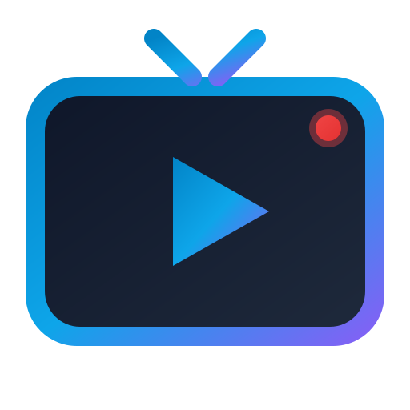

# 📺 LiveTV — Stream Live Television Channels

A modern, responsive, high-performance Live TV web application built with **React 19**, **Vite**, and **Tailwind CSS v4**. Stream live television, news, sports, entertainment, and movies across Mobile, Tablet, Desktop, and TV screens with zero friction.



---

## ✨ Features

### 🎬 Adaptive Video Player
- **HLS Adaptive Streaming**: Powered by `hls.js` with multi-bitrate resolution selection (`Auto`, `1080p`, `720p`, `480p`, etc.).
- **Picture-in-Picture (PiP)**: Multi-task seamlessly with native PiP mode (`P`).
- **Theater Mode**: Expand the video player to full viewport width (`T`).
- **Sleep Timer**: Auto-pause stream after 15, 30, 45, 60, or 90 minutes with a live countdown display.
- **Auto-Recovery & Fallback**: Automatic network/media error recovery with graceful fallback to backup stream if offline.
- **Smooth Volume Controls**: Volume slider with memory and mute/unmute (`M`).
- **Live Status & Clock**: Pulsating LIVE indicator and real-time digital clock in HUD overlay.
- **Mobile Orientation Lock**: Automatically triggers landscape orientation upon entering fullscreen on mobile.

---

### 🎨 System Theme Support (Light & Dark)
- **Theme Modes**: Supports **System**, **Light**, and **Dark** modes.
- **Auto-Detection**: Dynamically reacts to OS color scheme changes (`prefers-color-scheme: dark`).
- **Zero FOUC**: Pre-hydration script eliminates Flash of Unstyled Content on page load.
- **Modern Glassmorphism**: Polished light and dark design tokens, smooth transitions, and glowing UI elements.

---

### 📱 Responsive Design for All Devices
- **Mobile Phones**: Compact header, slide-out drawer, and bottom navigation quick bar for instant category & favorites switching.
- **Tablets & Laptops**: Collapsible sidebar, horizontal scrollable category pills with count badges.
- **Desktop & Smart TVs**: High-contrast active channel indicators, keyboard shortcuts, and TV-friendly focus states.

---

### 📋 Channel & Playlist Management
- **Instant Search (`/`)**: Real-time channel and category search with clear button.
- **Category Filter Chips**: Dynamic category tags with live channel counts.
- **⭐ Favorites System**: Bookmark favorite channels with one click (persisted in `localStorage`).
- **🕒 Watch History**: Automatically tracks recent channels with clear history support.
- **Sort Options**: Sort channels alphabetically (`A-Z`) or by default playlist sequence.
- **Custom M3U Support**:
  - Load custom M3U/M3U8 playlists from any public URL.
  - Upload `.m3u` or `.m3u8` files directly.
  - Paste raw M3U playlist text.
  - One-click reset to built-in default channels.

---

### ⌨️ Keyboard Shortcuts
| Key | Action |
|---|---|
| <kbd>Space</kbd> / <kbd>K</kbd> | Play / Pause Stream |
| <kbd>M</kbd> | Mute / Unmute Audio |
| <kbd>F</kbd> | Toggle Fullscreen Mode |
| <kbd>P</kbd> | Toggle Picture-in-Picture (PiP) |
| <kbd>T</kbd> | Toggle Theater Mode |
| <kbd>↑</kbd> / <kbd>↓</kbd> | Volume Up / Down (5% steps) |
| <kbd>[</kbd> / <kbd>]</kbd> | Previous / Next Channel |
| <kbd>R</kbd> | Reload Current Live Stream |
| <kbd>/</kbd> | Focus Search Bar |
| <kbd>?</kbd> | Open Keyboard Shortcuts Help Modal |
| <kbd>Esc</kbd> | Close Modals / Exit Fullscreen |

---

### 🌐 SEO & PWA Ready
- **PWA Manifest**: [`public/manifest.webmanifest`](public/manifest.webmanifest) for installability on mobile & desktop.
- **SVG Favicon**: Scalable modern vector TV icon.
- **OpenGraph & Twitter Cards**: Pre-configured rich social sharing metadata.
- **Dynamic Meta Tags**: Automated `color-scheme` and `theme-color` meta synchronization.

---

## 🛠️ Tech Stack

- **Frontend Library**: [React 19](https://react.dev/)
- **Build Tool**: [Vite](https://vitejs.dev/)
- **Styling**: [Tailwind CSS v4](https://tailwindcss.com/)
- **Streaming Engine**: [hls.js](https://github.com/video-dev/hls.js)
- **Icons**: [Lucide React](https://lucide.dev/)

---

## 🚀 Getting Started

### Prerequisites
- [Node.js](https://nodejs.org/) (v18 or higher recommended)
- `npm` or `yarn` or `pnpm`

### Installation

1. **Clone the repository**
   ```bash
   git clone https://github.com/CodesRahul96/Live-TV.git
   cd Live-TV
   ```

2. **Install dependencies**
   ```bash
   npm install
   ```

3. **Start the development server**
   ```bash
   npm run dev
   ```
   Open [http://localhost:5173](http://localhost:5173) in your browser.

4. **Build for production**
   ```bash
   npm run build
   ```

5. **Preview production build**
   ```bash
   npm run preview
   ```

---

## 📁 Project Structure

```
Live-TV/
├── public/
│   ├── favicon.svg             # Modern vector TV icon
│   └── manifest.webmanifest    # PWA web app manifest
├── src/
│   ├── assets/
│   │   └── playlist.txt        # Default M3U playlist
│   ├── components/
│   │   ├── ChannelList.jsx     # Search, category chips, channel cards, favorites
│   │   ├── CustomPlayer.jsx    # HLS video player with HUD, quality, timer, PiP
│   │   ├── Layout.jsx          # Header, responsive sidebars, bottom nav
│   │   ├── PlaylistModal.jsx   # Custom M3U URL / file / text importer
│   │   ├── ShortcutsModal.jsx  # Keyboard shortcuts cheatsheet modal
│   │   ├── ThemeToggle.jsx     # System / Light / Dark selector
│   │   └── Toast.jsx           # Action notification toasts
│   ├── context/
│   │   └── ThemeContext.jsx    # System/Light/Dark state & media listeners
│   ├── hooks/
│   │   └── useChannels.js      # M3U parser, playlist, favorites, history
│   ├── App.jsx                 # Core application orchestration
│   ├── index.css               # Tailwind v4 directives & custom tokens
│   └── main.jsx                # React application root
├── index.html                  # SEO metadata, font preloads, theme script
├── package.json
└── vite.config.js
```

---

## 📝 Custom Playlist Format

You can load your own channels via the in-app **M3U button** or by editing `src/assets/playlist.txt`. It supports standard IPTV M3U format:

```m3u
#EXTM3U
#EXTINF:-1 tvg-id="1" tvg-logo="https://example.com/logo.png" group-title="News",News 24/7
https://example.com/stream/index.m3u8
```

---

## 🤝 Contributing

Contributions, issues, and feature requests are welcome! Feel free to check out the [issues page](https://github.com/CodesRahul96/Live-TV/issues).

---

## 📄 License

This project is open-source and available under the [MIT License](LICENSE).
